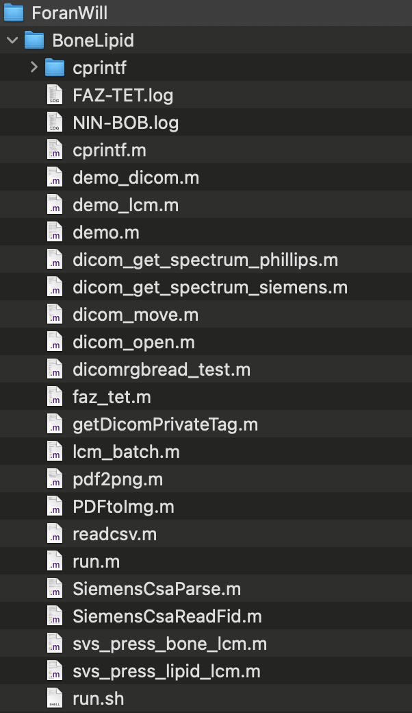
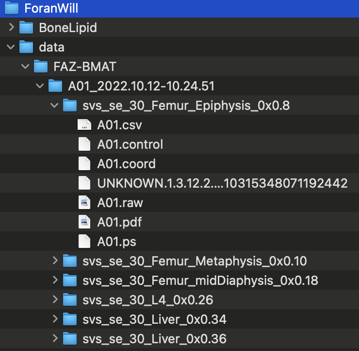

**SVS Bone Lipid LCM processing**

0\. Main folders:

<u>DICOM folder in GYRUS2 server:</u>

For example,

\~/scan_data/FAZ-BMAT

\~ /scan_data/FAZ-BMAT(Propject)/2024.08.16-10.15.00(Study
date)/C06(Subject)/\*

Sequences are (sequence \# and names are fixed)

> svs_se_30_Femur_Epiphysis_0x0.8 (SVS DICOM)
>
> svs_se_30_Femur_Epiphysis_ref_0x0.7 (ROI three orthogonal slices)
>
> svs_se_30_Femur_Metaphysis_0x0.10
>
> svs_se_30_Femur_Metaphysis_ref_0x0.9
>
> svs_se_30_Femur_midDiaphysis_0x0.18
>
> svs_se_30_Femur_midDiaphysis_ref_0x0.17
>
> svs_se_30_L4_0x0.27
>
> svs_se_30_L4_ref_0x0.26
>
> svs_se_30_Liver_0x0.35
>
> svs_se_30_Liver_ref_0x0.34

<u>Script/code folder: “ForanWill/BoneLipid”</u>

> FAZ-TET.log demo_dicom.m getDicomPrivateTag.m
>
> NIN-BOB.log demo_lcm.m lcm_batch.m
>
> PDFtoImg.m dicom_get_spectrum_phillips.m pdf2png.m
>
> SiemensCsaParse.m dicom_get_spectrum_siemens.m readcsv.m
>
> SiemensCsaReadFid.m dicom_move.m run.m
>
> cprintf dicom_open.m run.sh
>
> cprintf.m dicomrgbread_test.m svs_press_bone_lcm.m
>
> demo.m faz_tet.m svs_press_lipid_lcm.m

run.m – project name, call batch files

lcm_batch.m - retrieve all studies, dates, and subjects

svs_press_lipid_lcm.m – run LCM

<u>Data: The script copies original DICOM from GYRUS2 to \~/data folder
(data/Project/Subject_data)</u>

1\. Processing

; Edit run.m -\> calling lcm_batch.m -\> call svs_press_lipid_lcm.m per
sequence

; basis file -\>
\~/moonc/.lcmodel/basis-sets/3T/gamma_press_te30_123mhz_106.basis

The file is saved in
“\~/ForanWill/LCM_basis/gamma_press_te30_123mhz_106.basis”
