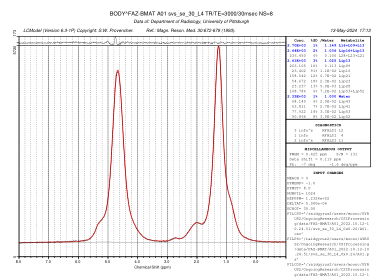

# SVS Bone Lipid LCM processing


## Processing
 * [`run.m`](BoneLipid/run.m)  – project name, call batch files
  * [`lcm_batch.m`](BoneLipid/lcm_batch.m) - retrieve all studies, dates, and subjects 
    * [`svs_press_lipid_lcm.m`](BoneLipid/svs_press_lipid_lcm.m) per sequence - run LCM

Basis file for LCModel included at `LCM_basis/gamma_press_te30_123mhz_106.basis`

### LCModel
see https://github.com/LabNeuroCogDevel/MRSIcoord.py/blob/master/Makefile#L23 for building LCModel from source.

output like


# Raw DICOM

For example, see [`data/FAZ-BMAT/A01_2022.10.12-10.24.51/`](data/FAZ-BMAT/A01_2022.10.12-10.24.51/).

Sequences are (sequence number and names are fixed)

```
svs_se_30_Femur_Epiphysis_0x0.8     # SVS DICOM
svs_se_30_Femur_Epiphysis_ref_0x0.7 # ROI three orthogonal slices

svs_se_30_Femur_Metaphysis_0x0.10
svs_se_30_Femur_Metaphysis_ref_0x0.9
svs_se_30_Femur_midDiaphysis_0x0.18
svs_se_30_Femur_midDiaphysis_ref_0x0.17
svs_se_30_L4_0x0.27
svs_se_30_L4_ref_0x0.26
svs_se_30_Liver_0x0.35
svs_se_30_Liver_ref_0x0.34
```

On Gyrus `/disk/mace2` files are found like

```
scan_data/$Propject/$StudyDate/$Subject/svs_*/
scan_data/FAZ-BMAT/2024.08.16-10.15.00/C06/svs_*/
```


